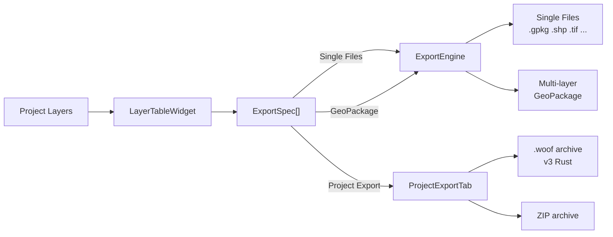

# Dock Export

Export layers from QGIS without the repetitive clicking. Pick your layers, set things up once, and export to single files, a multi-layer GeoPackage, or a portable `.woof` / ZIP archive.

---

## What problem does this solve?

Normally in QGIS, exporting a few layers means right-click → Export → pick format → pick path → repeat. Need the same layer in three formats? Do it three times. Want to filter, reproject, and style? More dialogs per layer. Sharing a 20-layer project? Export them one by one or zip the project file and hope the file paths match.

Dock Export replaces that with one dock, combining what would normally take multiple plugins (style exporter + project exporter + multi-format batch export) into a single tool:

- **Select layers once** from a single list
- **Configure everything in one place** — rename, filter, reproject, pick fields, apply styles
- **Export in one click** — single files, one GeoPackage, or a self-contained `.woof` / ZIP archive with rewritten project paths

---

### Gallery

| Single Files Tab                            | GeoPackage Tab                          | Project Export Tab                             | History Tab                             |
| ------------------------------------------- | --------------------------------------- | ---------------------------------------------- | --------------------------------------- |
|  |  |  |  |

---

## How it works

---

## Features

### Export modes

| Mode               | What it does                                                                        | Best for                                                              |
| ------------------ | ----------------------------------------------------------------------------------- | --------------------------------------------------------------------- |
| **Single Files**   | Each layer → one or more files in a folder (GPKG, Shapefile, GeoTIFF, ...)         | Sending layers individually, converting formats, archiving in folders |
| **GeoPackage**     | All layers → one`.gpkg` with separate tables                                       | Sharing many layers as one file                                       |
| **Project Export** | Whole project →`.woof` archive or `.zip` with source files + rewritten project XML | Sending a project to someone, backups, moving between machines        |

### Per-layer controls

- **Rename** — per-layer export name with `{layer_name}`, `{date}`, `{crs}`, `{datetime}` placeholders
- **Filter** — per-layer QGIS expression (`WHERE` clause) with field list, function tree, search, validation
- **Reproject** — per-layer CRS via the native QGIS projection picker
- **Field subset** — pick which attributes to include
- **Format override** — force a specific driver for a layer (e.g. Shapefile while the rest use GPKG)

### Formats

**Vector** — detected from GDAL at runtime (about 36 write-capable drivers). Known ones:

GPKG, ESRI Shapefile, GeoJSON, GeoJSON (Newline Delimited), KML, LIBKML, CSV, FlatGeobuf, GPX, GML, TopoJSON, SQLite, SpatiaLite, DXF, DGN, MapInfo TAB, GeoParquet, Arrow, MBTiles, OpenFileGDB, ESRI FileGDB, GeoRSS, MVT, PMTiles, JSONFG (OGC JSON), MapML, PDF (Geospatial), VDV, JML (OpenJUMP), PGDUMP (PostgreSQL SQL), MiraMon Vector, GMT ASCII, Selafin, WAsP, XLSX, ODS.

> Database/cloud drivers (MySQL, PostgreSQL, Oracle, Carto, etc.) are excluded — they need live connections, not file paths.

**Raster** — also detected at runtime (21+ write-capable drivers). Known ones:

GeoTIFF, Cloud Optimized GeoTIFF, Virtual Raster, ENVI, EHdr (ESRI BIL), PNG, JPEG, JPEG XL, GIF, NetCDF, BMP, MBTiles, ERDAS Imagine (.img), PCIDSK, NITF, GRIB, SAGA GIS, Zarr, AAIGrid (ASCII), XYZ Grid, PDF (Geospatial), PCRaster, ILWIS, RST (Idrisi), ZMap, SIGDEM.

### Styles

- **QML sidecars** — `.qml` files next to exported files
- **SLD sidecars** — `.sld` files (vector only)
- **Embed in GPKG** — styles stored in the `layer_styles` table (Single Files GPKG and GeoPackage tab)

### Archive export (.woof / ZIP)

- **.woof** — Rust native archive format: xxhash3-64 integrity checks, seek table for random access, per-entry zstd compression, parallel decompression
- **ZIP** — standard deflate via Python `zipfile`
- **Compression** — None / Normal / Heavy (woof: zstd 0 / 3 / 9; ZIP: STORE / DEFLATE+6 / DEFLATE+9)
- **Remote layers** — WMS, WFS, PostGIS, etc. keep their original datasource URLs
- **Sidecars** — QML, SLD, world files (`.tfw`, `.pgw`, `.jgw`, ...) are collected automatically
- **Project resources** — layout images, SVGs, HTML items, report templates included
- **ArcGIS Pro integration** — check "Generate ArcPy script" in the Project Export tab to embed `open_in_arcgis_pro.py` + `layer_tree.json` inside the archive. After extraction, running the script recreates your QGIS layer groups as an ArcGIS Pro project.

### QGIS integration

- Docks in the main QGIS window
- Right-click a layer → opens Dock Export with it preselected
- `.woof` files open from Project → Open From → Open `.woof` Project
- Auto-refreshes when layers are added, removed, or renamed
- Settings persist between sessions via `QgsSettings`

---

## .woof Format

A `.woof` file is a single-file snapshot of a QGIS project. It bundles every file the project depends on — vector datasets, rasters, GeoPackages, styles, world files, layout images, SVGs, report templates — plus the project file itself with all paths rewritten to relative references inside the archive.

Open it from QGIS via Project → Open From → Open `.woof` Project. The archive is extracted in memory and the project loads with all paths resolved. Remote layers keep their original URLs. Scratch and memory layers are noted as not packaged.

The native Rust crate (`native_woof_impl`) powers the format: each entry has its own zstd compression level, xxhash3-64 hash, and seek-table metadata for random access. Decompression runs in parallel for fast extraction.

## License

GNU General Public License v2.0 or later. See `LICENSE`.
