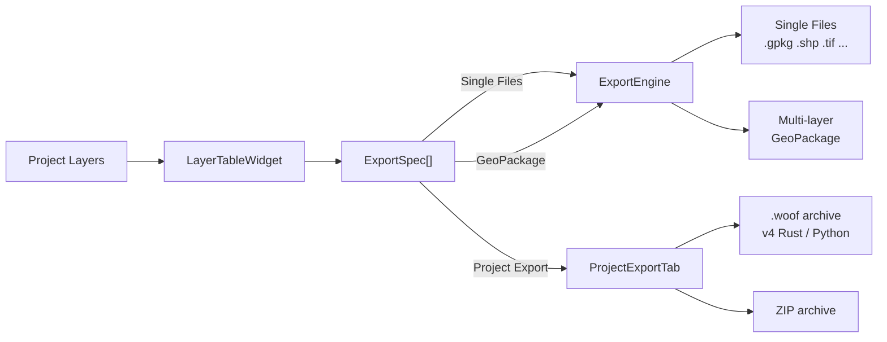

<div align="center">


# Dock Export

Export layers to single files, multi-layer GeoPackage, or portable `.woof` / ZIP archives.

[![License][license-badge]][license-url]
[![Last commit][commit-badge]][commits-url]
[![Issues][issues-badge]][issues-url]
[![Code size][size-badge]][repo-url]
[![Python][python-badge]][pyproject-url]
[![QGIS][qgis-badge]][qgis-url]
[![CI][ci-badge]][ci-url]
[![OpenSSF Scorecard][scorecard-badge]][scorecard-url]

</div>

## Overview

QGIS does not provide a single interface for batch-exporting layers in different formats. Each layer must be exported individually, with no built-in way to apply consistent filters, reprojections, or field selections across multiple layers.

Dock Export combines layer selection, format configuration, and batch export into a single dock:

- **Select layers** from a single list
- **Configure export settings** - rename, filter, reproject, pick fields, apply styles
- **Export** to single files, one GeoPackage, or a self-contained `.woof` / ZIP archive with rewritten project paths

## Gallery

| Single Files Tab | GeoPackage Tab | Project Export Tab | History Tab |
|---|---|---|---|
|  |  |  |  |

## How it works


```mermaid
graph LR
    L["Project Layers"] --> LTW["LayerTableWidget"]
    LTW --> SPECS["ExportSpec[]"]
    SPECS -->|"Single Files"| ENG["ExportEngine"]
    SPECS -->|"GeoPackage"| ENG
    SPECS -->|"Project Export"| PET["ProjectExportTab"]

    ENG --> SF["Single Files<br>.gpkg .shp .tif ..."]
    ENG --> GPKG["Multi-layer<br>GeoPackage"]

    PET --> WOOF[".woof archive<br>v4 Rust / Python"]
    PET --> ZIP["ZIP archive"]
```

## Features

### Export modes

| Mode | What it does | Best for |
|---|---|---|
| **Single Files** | Each layer to one or more files in a folder (GPKG, Shapefile, GeoTIFF, ...) | Sending layers individually, converting formats, archiving in folders |
| **GeoPackage** | All layers to one `.gpkg` with separate tables | Sharing many layers as one file |
| **Project Export** | Whole project to `.woof` archive or `.zip` with source files + rewritten project XML | Sending a project to someone, backups, moving between machines |

### Per-layer controls

- **Rename** - per-layer export name with `{layer_name}`, `{date}`, `{crs}`, `{datetime}` placeholders
- **Filter** - per-layer QGIS expression (`WHERE` clause) with field list, function tree, search, validation
- **Reproject** - per-layer CRS via the native QGIS projection picker
- **Field subset** - pick which attributes to include
- **Format override** - force a specific driver for a layer (e.g. Shapefile while the rest use GPKG)

### Formats

The available drivers are detected from GDAL at runtime. Common write-capable formats:

| Type | Formats |
|---|---|
| Vector | GeoPackage, ESRI Shapefile, GeoJSON, KML, CSV, FlatGeobuf, GPX, GML, SQLite, SpatiaLite, DXF, MBTiles, OpenFileGDB, GeoParquet, MVT, PMTiles, XLSX, ODS |
| Raster | GeoTIFF, Cloud Optimized GeoTIFF, PNG, JPEG, JPEG XL, GIF, NetCDF, BMP, MBTiles, ERDAS Imagine, PCIDSK, GRIB, SAGA GIS, Zarr, PDF (Geospatial), RST |

The exact list depends on the GDAL build in your QGIS installation. See the [GDAL vector format](https://gdal.org/drivers/vector/index.html) and [GDAL raster format](https://gdal.org/drivers/raster/index.html) documentation for the full catalog.

> Database/cloud drivers (MySQL, PostgreSQL, Oracle, Carto, etc.) are excluded - they need live connections, not file paths.

### Styles

- **QML sidecars** - `.qml` files next to exported files
- **SLD sidecars** - `.sld` files (vector only)
- **Embed in GPKG** - styles stored in the `layer_styles` table (Single Files GPKG and GeoPackage tab)

### Archive export (.woof / ZIP)

- **.woof** - custom archive format with two backend implementations:
  - **Rust (fast path)** - xxhash3-64 integrity checks, seek table for O(log n) random access, per-entry zstd compression, content-addressed dedup, parallel decompression. Install separately (see below).
  - **Python (default path)** - same v4 format read/write, per-entry zstd compression, full backward compatibility with Rust-created archives. Shipped in the QGIS official plugin.
- **ZIP** - standard deflate via Python `zipfile`
- **Compression** - None / Normal / Heavy (woof: zstd 0 / 3 / 9; ZIP: STORE / DEFLATE+6 / DEFLATE+9)
- **Remote layers** - WMS, WFS, PostGIS, etc. keep their original datasource URLs
- **Sidecars** - QML, SLD, world files (`.tfw`, `.pgw`, `.jgw`, ...) are collected automatically
- **Project resources** - layout images, SVGs, HTML items, report templates included
- **ArcGIS Pro integration** - check "Generate ArcPy script" in the Project Export tab to embed `open_in_arcgis_pro.py` + `layer_tree.json` inside the archive. After extraction, running the script recreates your QGIS layer groups as an ArcGIS Pro project.

### QGIS integration

- Docks in the main QGIS window
- Right-click a layer to open Dock Export with it preselected
- `.woof` files open from Project -> Open From -> Open `.woof` Project
- Auto-refreshes when layers are added, removed, or renamed
- Settings persist between sessions via `QgsSettings`

## .woof Format

A `.woof` file is a single-file snapshot of a QGIS project. It bundles every file the project depends on - vector datasets, rasters, GeoPackages, styles, world files, layout images, SVGs, report templates - plus the project file itself with all paths rewritten to canonical `woof://` URIs.

Open it from QGIS via Project -> Open From -> Open `.woof` Project. The archive is extracted and the project loads with all paths resolved. Remote layers keep their original URLs. Scratch and memory layers are noted as not packaged.

### Dual-path implementation

The `.woof` format has two backend implementations that are 100% archive-compatible:

| Path | Language | Speed | Shipped in QGIS repo? | Features |
|---|---|---|---|---|
| **Default (Python)** | Python + `zstandard` | Moderate | Yes | v4 read/write, per-entry zstd, v2/v3/v4 compat, manifest |
| **Fast (Rust)** | Rust + PyO3 | 2-5x faster | No (optional install) | All of the above + seek table, dedup, xxhash3-64 checksums, parallel decompression |

Archives created by either backend can be read by the other. The Rust path adds performance and integrity guarantees but is not required for basic operation.

### Rust native module (optional performance upgrade)

The Rust crate (`woof_native/`) provides a native PyO3 module that accelerates packing, unpacking, and random-access extraction. To install:

```bash
# From source (requires Rust toolchain)
cd woof_native
cargo build --release
cp target/release/_native_impl.{dll,pyd,so} ../dock_export/_woof_native/

# Or via pip (when available)
pip install woof-native
```

The plugin falls back to pure Python automatically if the native module is absent.

### Manifest

Every `.woof` v4 archive contains a `woof-manifest.json` entry that records:

- Entry types (project, vector, raster, style, resource, arcpy, manifest)
- Dependency graph (companion files like `.shx`/`.dbf` for `.shp`)
- `woof://` URI rewrites for portable path resolution
- Per-entry hashes and sizes

### Content-addressed dedup (Rust only)

When the native module is active, identical content is stored once in the archive payload. Multiple seek entries pointing to different names can reference the same data if their xxhash3-64 hashes match. This is transparent on extraction - the Python fallback reads deduplicated archives correctly.

## Tech stack

| Tool | Purpose |
|---|---|
| Python 3.9+ | Plugin runtime |
| QGIS 3.22+ | Host application |
| Qt 5.x / 6.x | UI framework |
| zstandard | .woof compression (Python path) |
| Rust + PyO3 | .woof fast path (optional) |
| GDAL | Format detection and export drivers |

## Compatibility

| QGIS version | Qt | Python | Status |
|---|---|---|---|
| 3.22 LTR | Qt5 | 3.9+ | Tested in CI |
| 3.x stable | Qt5/Qt6 | 3.9+ | Tested in CI |
| 4.2 | Qt6 | 3.12+ | Tested in CI |
| 4.x latest | Qt6 | 3.12+ | Tested in CI |

## Limitations

- The Python `.woof` path needs the `zstandard` package (`pip install zstandard`); without it, ZIP export still works but `.woof` does not.
- Database/cloud drivers are excluded from the format lists because they need live connections, not file paths.
- Remote layers (WMS, WFS, PostGIS) keep their original URLs in archives; they are not bundled, so archives with only remote layers need network access to load.
- Scratch and memory layers are noted as not packaged in `.woof` archives.

## Contributing

See [CONTRIBUTING.md](CONTRIBUTING.md).

## Security

See [SECURITY.md](SECURITY.md).

## License

GNU General Public License v3.0 - see [LICENSE](LICENSE).

[license-badge]: https://img.shields.io/github/license/Wolren/DockExporter
[license-url]: LICENSE
[commit-badge]: https://img.shields.io/github/last-commit/Wolren/DockExporter
[commits-url]: https://github.com/Wolren/DockExporter/commits
[issues-badge]: https://img.shields.io/github/issues/Wolren/DockExporter
[issues-url]: https://github.com/Wolren/DockExporter/issues
[size-badge]: https://img.shields.io/github/languages/code-size/Wolren/DockExporter
[repo-url]: https://github.com/Wolren/DockExporter
[python-badge]: https://img.shields.io/badge/Python-3.9+-blue?logo=python
[pyproject-url]: pyproject.toml
[qgis-badge]: https://img.shields.io/badge/QGIS-3.22+-green
[qgis-url]: https://qgis.org
[ci-badge]: https://github.com/Wolren/DockExporter/actions/workflows/ci.yml/badge.svg
[ci-url]: https://github.com/Wolren/DockExporter/actions/workflows/ci.yml
[scorecard-badge]: https://api.securityscorecards.dev/projects/github.com/Wolren/DockExporter/badge
[scorecard-url]: https://securityscorecards.dev/viewer/?uri=github.com/Wolren/DockExporter
