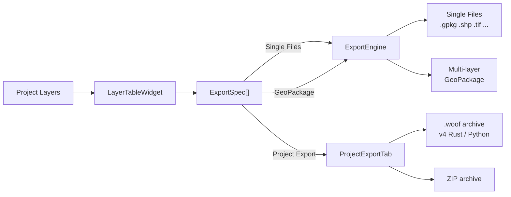

# Dock Export

Export layers to single files, multi-layer GeoPackage, or portable `.woof` / ZIP archives.

[![License][license-badge]][license-url]
[![Last commit][commit-badge]][commits-url]
[![Issues][issues-badge]][issues-url]
[![Code size][size-badge]][repo-url]
[![Python][python-badge]][pyproject-url]
[![QGIS][qgis-badge]][qgis-url]
[![CI][ci-badge]][ci-url]
[![OpenSSF Scorecard][scorecard-badge]][scorecard-url]

## Overview

QGIS exports each layer individually, with no built-in way to apply consistent filters, reprojections, or field selections across multiple layers. Dock Export combines layer selection, format configuration, and batch export into a single dock:

- Select layers from a single list
- Configure export settings: rename, filter, reproject, pick fields, apply styles
- Export to single files, one GeoPackage, or a self-contained `.woof` / ZIP archive with rewritten project paths

## Gallery

| Single Files Tab | GeoPackage Tab | Project Export Tab | History Tab |
|---|---|---|---|
|  |  |  |  |

## How it works

```mermaid
graph LR
    L["Project Layers"] --> LTW["LayerTableWidget"]
    LTW --> SPECS["ExportSpec[]"]
    SPECS -->|"Single Files"| ENG["ExportEngine"]
    SPECS -->|"GeoPackage"| ENG
    SPECS -->|"Project Export"| PET["ProjectExportTab"]
    ENG --> SF["Single Files<br>.gpkg .shp .tif ..."]
    ENG --> GPKG["Multi-layer<br>GeoPackage"]
    PET --> WOOF[".woof archive<br>v4 Rust / Python"]
    PET --> ZIP["ZIP archive"]
```

## Features

### Export modes

| Mode | What it does | Best for |
|---|---|---|
| **Single Files** | Each layer to one or more files in a folder | Sending layers individually, converting formats |
| **GeoPackage** | All layers to one `.gpkg` with separate tables | Sharing many layers as one file |
| **Project Export** | Whole project to `.woof` archive or `.zip` with source files + rewritten project XML | Sending a project, backups, moving between machines |

### Per-layer controls

- **Rename** - per-layer export name with `{layer_name}`, `{date}`, `{crs}`, `{datetime}` placeholders
- **Filter** - per-layer QGIS expression with field list, function tree, search, validation
- **Reproject** - per-layer CRS via the native QGIS projection picker
- **Field subset** - pick which attributes to include
- **Format override** - force a specific driver for a layer (e.g. Shapefile while the rest use GPKG)

### Formats

All GDAL write-capable vector and raster formats are available, detected at runtime (GeoPackage, Shapefile, GeoJSON, GeoTIFF, and 50+ more). Database and cloud drivers are excluded - they need live connections, not file paths. See the [GDAL vector](https://gdal.org/drivers/vector/index.html) and [GDAL raster](https://gdal.org/drivers/raster/index.html) format catalogs.

### Styles

- **QML sidecars** - `.qml` files next to exported files
- **SLD sidecars** - `.sld` files (vector only)
- **Embed in GPKG** - styles stored in the `layer_styles` table

### Project export

- **`.woof`** - single-file project snapshot with rewritten `woof://` paths, zstd compression, and integrity checks
- **ZIP** - standard deflate archive
- **Remote layers** - WMS, WFS, PostGIS, etc. keep their original datasource URLs
- **Sidecars and resources** - QML, SLD, world files, layout images, SVGs, report templates collected automatically
- **ArcGIS Pro** - optional embedded ArcPy script that recreates your layer groups as an ArcGIS Pro project

### QGIS integration

- Docks in the main QGIS window
- Right-click a layer to open Dock Export with it preselected
- `.woof` files open from Project -> Open From -> Open `.woof` Project
- Auto-refreshes when layers are added, removed, or renamed
- Settings persist between sessions via `QgsSettings`

## .woof Format

A `.woof` file is a single-file snapshot of a QGIS project: every file the project depends on (vector datasets, rasters, GeoPackages, styles, layout images, SVGs, report templates) plus the project file with all paths rewritten to `woof://` URIs. Open it from QGIS via Project -> Open From -> Open `.woof` Project.

| Path | Language | Speed | Shipped in QGIS repo? |
|---|---|---|---|
| **Default** | Python + `zstandard` | Moderate | Yes |
| **Fast** | Rust + PyO3 | 2-5x faster | No (optional install) |

Archives are 100% compatible between both backends. The Rust path adds a seek table, content-addressed dedup, xxhash3-64 checksums, and parallel decompression.

Format internals (manifest schema, dedup, native module build) are documented in [docs/WOOF_FORMAT.md](docs/WOOF_FORMAT.md).

## Tech stack

| Tool | Purpose |
|---|---|
| Python 3.9+ | Plugin runtime |
| QGIS 3.22+ | Host application |
| Qt 5.x / 6.x | UI framework |
| zstandard | `.woof` compression (Python path) |
| Rust + PyO3 | `.woof` fast path (optional) |
| GDAL | Format detection and export drivers |

## Compatibility

| QGIS version | Qt | Python | Status |
|---|---|---|---|
| 3.22 LTR | Qt5 | 3.9+ | Tested in CI |
| 3.x stable | Qt5/Qt6 | 3.9+ | Tested in CI |
| 4.2 | Qt6 | 3.12+ | Tested in CI |
| 4.x latest | Qt6 | 3.12+ | Tested in CI |

## Limitations

- The Python `.woof` path needs the `zstandard` package (`pip install zstandard`); without it, ZIP export still works but `.woof` does not.
- Remote layers (WMS, WFS, PostGIS) keep their original URLs in archives; they are not bundled, so archives with only remote layers need network access to load.
- Scratch and memory layers are noted as not packaged in `.woof` archives.

## Contributing

See [CONTRIBUTING.md](CONTRIBUTING.md).

## Security

See [SECURITY.md](SECURITY.md).

## License

GNU General Public License v3.0 - see [LICENSE](LICENSE).

[license-badge]: https://img.shields.io/github/license/Wolren/DockExporter
[license-url]: LICENSE
[commit-badge]: https://img.shields.io/github/last-commit/Wolren/DockExporter
[commits-url]: https://github.com/Wolren/DockExporter/commits
[issues-badge]: https://img.shields.io/github/issues/Wolren/DockExporter
[issues-url]: https://github.com/Wolren/DockExporter/issues
[size-badge]: https://img.shields.io/github/languages/code-size/Wolren/DockExporter
[repo-url]: https://github.com/Wolren/DockExporter
[python-badge]: https://img.shields.io/badge/Python-3.9+-blue?logo=python
[pyproject-url]: pyproject.toml
[qgis-badge]: https://img.shields.io/badge/QGIS-3.22+-green
[qgis-url]: https://qgis.org
[ci-badge]: https://github.com/Wolren/DockExporter/actions/workflows/ci.yml/badge.svg
[ci-url]: https://github.com/Wolren/DockExporter/actions/workflows/ci.yml
[scorecard-badge]: https://api.securityscorecards.dev/projects/github.com/Wolren/DockExporter/badge
[scorecard-url]: https://securityscorecards.dev/viewer/?uri=github.com/Wolren/DockExporter
